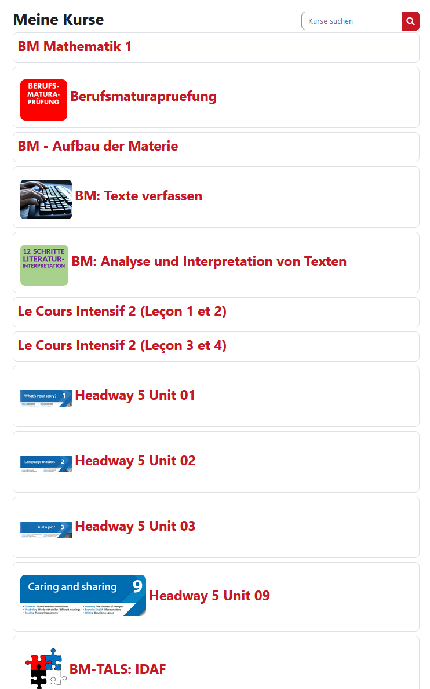

# Userscripts & Styles

A collection of userscripts and userstyles mostly made for BBBaden's adaption of Moodle.
By me and other credited users

Install [Violentmonkey](https://violentmonkey.github.io/)

Install [Stylus](https://github.com/openstyles/stylus)

## Midnight Moodle

> [!NOTE]  
> Theme Moodle Into diffrent themes [Light, Dark, Midnight & Custom invertion values]

## Moodle File Downloader

> [!NOTE]  
> Zips all files of the currently opened moodle course and downloads them.

## CompactFrontpage

